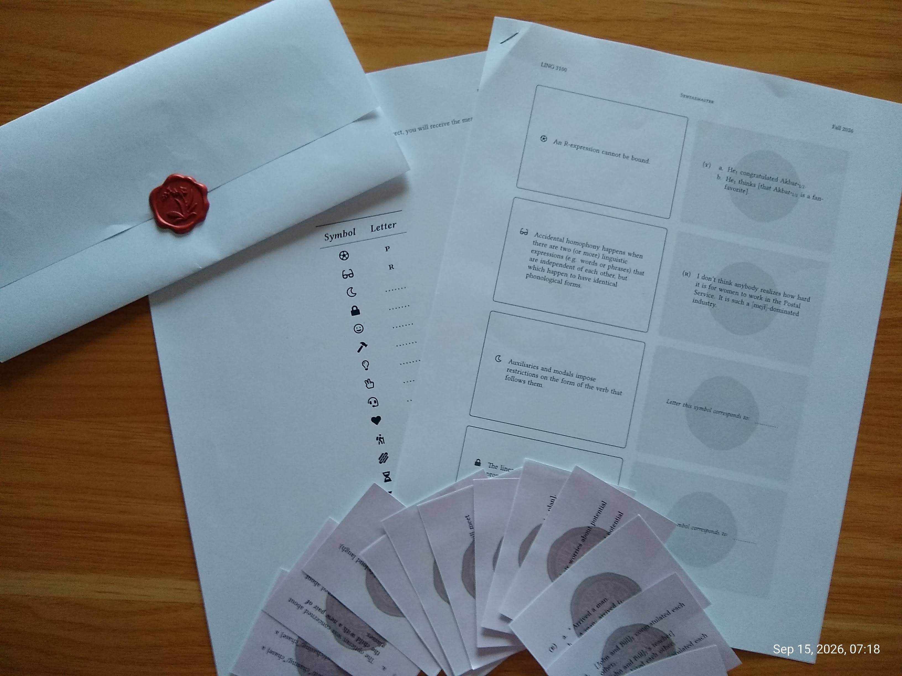

## Textbook

The current version of an Intro to syntax textbook I am writing can be downloaded [here](files/Introduction_to_syntax_textbook_September_2025.pdf) (version of September, 2025). Criticism more than welcome!

(_Upcoming chapters_: ditransitives, raising and control, A-movement, head movement.)

## Memorial University of Newfounland
+ Introduction to Syntax 1103 (Fall 2026, Fall 2025, Winter 2025, Fall 2024)
+ Syntactic Theory 3100 (Fall 2026)
+ Morphology 3000 (Winter 2026, Fall 2024)
+ Introduction to Linguistics 1100 (Winter 2026)
+ Field Methods 4500/6500 (Fall 2025; crosslisted)
+ Seminar in Research Methods 7000 (Fall 2026; graduate)
+ Selected topics in syntactic theory 4110/6110 (Winter 2025; crosslisted)
  + Lecture materials: [HO1](https://sznfng.github.io/files/agree_course/Selected_topics_in_syntactic_theory_4110_6110_Winter_2025_handout%201.pdf) / [HO2a](https://sznfng.github.io/files/agree_course/Selected_topics_in_syntactic_theory_4110_6110_Winter_2025_handout%202a.pdf) / [HO2b](https://sznfng.github.io/files/agree_course/Selected_topics_in_syntactic_theory_4110_6110_Winter_2025_handout%202b.pdf) / [HO2c](https://sznfng.github.io/files/agree_course/Selected_topics_in_syntactic_theory_4110_6110_Winter_2025_handout%202c.pdf) / [HO3a](https://sznfng.github.io/files/agree_course/Selected_topics_in_syntactic_theory_4110_6110_Winter_2025_handout%203a.pdf) / [HO3b](https://sznfng.github.io/files/agree_course/Selected_topics_in_syntactic_theory_4110_6110_Winter_2025_handout%203b.pdf)/ [HO3c](https://sznfng.github.io/files/agree_course/Selected_topics_in_syntactic_theory_4110_6110_Winter_2025_handout%203c.pdf)

### Syntaxmaster

"Taskmaster" is a British game show where contestants attempt to complete a series of challenges. If you have never watched the show, I recommend [this video](https://www.youtube.com/watch?v=AzzJytRJGRY) and [this other video](https://www.youtube.com/watch?v=emz6GVWvJlo&t=24s).

"Syntaxmaster" is a linguistic version of one of the tasks from [S12E4](https://www.youtube.com/watch?v=b_oXhJqhVB0)

Ultimately, the goal of the game is to decipher a message. But this is just a pretext to get students to retrieve important syntactic concepts. The deciphering is done by pairing linguistic concepts or definitions with data that illustrate them. Each concept is assigned to a symbol, while each data point is assigned a letter. By pairing each concept with the data that exemplifies it, the players arrive at a cipher that decodes the message.

For example, let's say that the message to be decoded contains the symbol "♠." This symbol is associated with the following definition: "An anaphor must be c-commanded by its antecedent." In order to figure out which letter "♠" corresponds to, the players must inspect a set of sentences and converge on a pair of sentences like "Mary praised herself" vs. "*Mary's grandparents praised herself." Assuming further that these data are associated with the letter "S," players will, then, have uncovered part of the cipher, so that they are now able to translate the "♠" in the coded message into an "S."

[Instructions](files/syntaxmaster/3100_Syntactic_Theory_F26_syntaxmaster_instructions.pdf) / [Board](files/syntaxmaster/3100_Syntactic_Theory_F26_syntaxmaster_board.pdf) / [Cards](files/syntaxmaster/3100_Syntactic_Theory_F26_cards.pdf) / [Cipher](files/syntaxmaster/3100_Syntactic_Theory_F26_syntaxmaster_cipher.pdf) / [Message](files/syntaxmaster/3100_Syntactic_Theory_F26_syntaxmaster_message.pdf)
    
*.tex* version of files above, but with minimal formatting can be downloaded [here](https://www.overleaf.com/read/rhjtpdyqfcpr#3abd32).

## Previous teaching

### Yale University
+ Syntax II (LING 254/654, Spring 2023), undergraduate/graduate course
+ Linguistics in the real world (LING 106, Spring 2023), undergraduate course
+ Morphology (LING 280/680, Fall 2022), undergraduate/graduate
+ Current Trends in Syntax: the Operation Agree (LING 261/681, Fall 2022), undergraduate/graduate course

### Queen Mary University of London
+ Introduction to Semantics (LIN5217, Fall 2021), BA/MA course
+ Syntax II Explaining Grammatical Structures (LIN5213, Fall 2021), BA course
+ Syntax (MA, LIN7209, Fall 2021), MA course

## 2025 LSA Summer Institute

Hosted by the Linguistics Department at the University of Oregon on July--August/2025. I taught [Introduction to Generative Syntax](https://center.uoregon.edu/LSA/2025/program/search/detail_session.php?id=13901702).

Lecture materials: [HO1](files/intro_syntax/Intro_Generative_Syntax_LSA_2025_HO1.pdf) / [HO2](files/intro_syntax/Intro_Generative_Syntax_LSA_2025_HO2.pdf) / [HO3](files/intro_syntax/Intro_Generative_Syntax_LSA_2025_HO3.pdf)/ [HO4](files/intro_syntax/Intro_Generative_Syntax_LSA_2025_HO4.pdf) / [HO5](files/intro_syntax/Intro_Generative_Syntax_LSA_2025_HO5.pdf) / [HO6](files/intro_syntax/Intro_Generative_Syntax_LSA_2025_HO6.pdf)

### ELBA (Escuela de Lingüística de Buenos Aires)
[Linguistics Summer School at Buenos Aires](https://escuela-linguistica-de-buenos-aires.github.io/)\
February/2020\
Topic: Theoretical approaches to hyperraising
